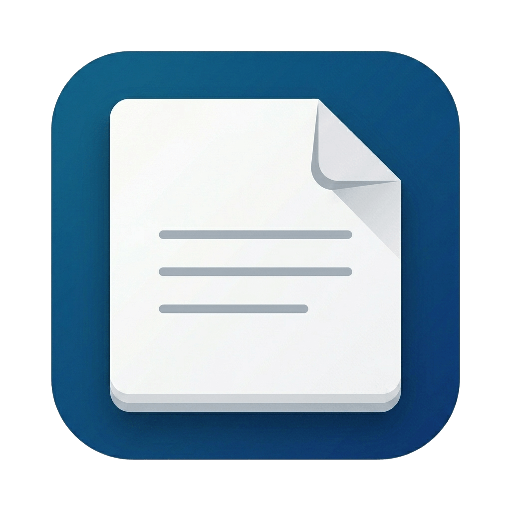

<p align="center">
  
</p>

<h1 align="center">Notes</h1>

<p align="center">
  Fast • Local-First • Private
</p>

<p align="center">
  A fast, local-first note-taking app built for focus.
</p>

Your notes live entirely on your device in a local SQLite database — no accounts, no cloud storage, no subscriptions, and no internet connection required.

Built with Tauri, React, TypeScript, and SQLite.

---

## Features

### Write Without Distractions

- Start writing instantly — notes autosave as you type.
- Save manually anytime with `Ctrl/⌘ + S`.
- Built-in Markdown preview.
- Focus mode for distraction-free writing.
- Full undo and redo support.
- Customize editor font family (Sans, Serif, or Monospace) and font size.

### Organize Your Workspace

- Create folders and nested subfolders.
- Browse notes from the sidebar or main workspace.
- Drag and drop notes and folders to reorganize them.
- Open multiple notes in tabs.
- Pin important notes for quick access.
- Recently opened notes are always within reach.

### Find Anything Quickly

- Search within the current note with match highlighting.
- Jump between search results instantly.
- Search across your entire note library.
- Open results directly from contextual search previews.

### Own Your Data

- Export notes as `.txt`, `.md`, or PDF files.
- Import text and code files as new notes.
- Create full-library backups with a single file.
- Restore backups at any time.
- Trash system with restore support and configurable auto-cleanup.

### Personalize the Experience

- Light, Dark, and System themes.
- Adjustable sidebar width.
- Tabbed settings interface.
- Designed to feel native on every platform.

---

## Keyboard Shortcuts

`Mod` = `Ctrl` on Windows/Linux and `⌘` on macOS.

| Shortcut          | Action                  |
| ----------------- | ----------------------- |
| `Mod + N`         | Create new note         |
| `Mod + S`         | Save current note       |
| `Mod + Z`         | Undo                    |
| `Mod + Shift + Z` | Redo                    |
| `Mod + F`         | Find in note            |
| `Mod + ↑`         | Previous match          |
| `Mod + ↓`         | Next match              |
| `Mod + Shift + F` | Search all notes        |
| `Mod + M`         | Toggle Markdown preview |
| `Mod + \`         | Toggle sidebar          |
| `Mod + ,`         | Open settings           |
| `Mod + Shift + +` | Increase font size      |
| `Mod + Shift + -` | Decrease font size      |

---

## Getting Started

### Requirements

- Node.js 20+
- npm
- Rust 1.77+
- Tauri prerequisites for your platform

Install Rust:

```bash
curl --proto '=https' --tlsv1.2 -sSf https://sh.rustup.rs | sh
```

On Debian/Ubuntu, install Tauri dependencies:

```bash
sudo apt install libwebkit2gtk-4.1-dev build-essential curl wget file \
  libxdo-dev libssl-dev libayatana-appindicator3-dev librsvg2-dev
```

### Run in Development

```bash
npm install
npm run tauri dev
```

---

## Building for Production

```bash
npm run tauri build
```

Generated application bundles can be found in:

```text
src-tauri/target/release/bundle/
```

Linux builds include:

- AppImage
- DEB
- RPM

---

## Data Storage

All notes are stored in your operating system's application data directory, separate from the project files.

This means rebuilding, updating, or reinstalling the application will never affect your notes.

Example Linux location:

```text
~/.config/com.akash.slate/notes.db
```

To reset the application:

1. Create a backup from **Settings → Data → Export**.
2. Quit the app.
3. Delete the `notes.db*` files.
